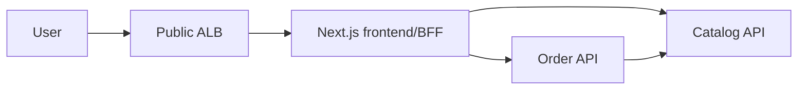

# TechX Platform

Minimal internship storefront implementing the end-to-end flow:

`browse products -> manage cart -> confirm order -> look up order`

This repository contains three independently runnable Node.js/TypeScript services:

| Service | Local port | Internal DNS | Public exposure |
|---|---:|---|---|
| `frontend` | `3000` | `frontend:3000` | Through the single frontend ALB only |
| `catalog-api` | `3001` | `catalog-api:3001` | Private `ClusterIP` |
| `order-api` | `3002` | `order-api:3002` | Private `ClusterIP` |

## Shared deployment contract

| Item | Value |
|---|---|
| Namespace | `techx-demo` |
| Secret / key | `techx-demo-secrets` / `order-api-key` |
| Health / readiness | `GET /healthz` / `GET /readyz` |
| Frontend image | `058114477594.dkr.ecr.us-east-1.amazonaws.com/techx/frontend:demo-<sha>` |
| Catalog image | `058114477594.dkr.ecr.us-east-1.amazonaws.com/techx/catalog:demo-<sha>` |
| Order image | `058114477594.dkr.ecr.us-east-1.amazonaws.com/techx/order:demo-<sha>` |

The browser talks only to same-origin frontend routes. `ORDER_API_KEY` remains server-side and is added by the frontend BFF when it calls Order API.

## API contract

- `GET /api/products`
- `GET /api/products/{id}`
- `POST /api/orders` with `{ "items": [{ "productId": string, "quantity": integer }] }`
- `GET /api/orders/{id}`

Order endpoints require `X-Demo-Key`. Create-order also requires `Idempotency-Key`. Errors use:

```json
{
  "error": {
    "code": "STRING_CODE",
    "message": "Human-readable message",
    "requestId": "request-correlation-id"
  }
}
```

## Topology



## Development

Copy `.env.example` to `.env`, replace the demo key, then install and run the commands documented as each service is implemented. No AWS resources are required for local development.

Bootstrap verification:

```powershell
./scripts/verify.ps1
```

## Attribution

The visual direction and sample commerce-domain patterns are adapted selectively from the TechX/OpenTelemetry demo sources. New implementation code in this repository is intentionally reduced to the internship thin slice.

Licensed under Apache-2.0. See [LICENSE](LICENSE).
