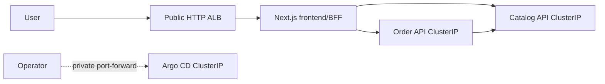

# TechX Platform

Minimal internship storefront implementing the end-to-end flow:

`browse products -> manage cart -> confirm order -> look up order`

This repository contains three independently runnable Node.js/TypeScript
services:

| Service       | Local port | Internal DNS       | Public exposure                      |
| ------------- | ---------: | ------------------ | ------------------------------------ |
| `frontend`    |     `3000` | `frontend:3000`    | Through the single frontend ALB only |
| `catalog-api` |     `3001` | `catalog-api:3001` | Private `ClusterIP`                  |
| `order-api`   |     `3002` | `order-api:3002`   | Private `ClusterIP`                  |

## Shared deployment contract

This table is the handoff contract copied verbatim across `techx-platform`,
`techx-chart`, and `techx-infra`. Contract changes must update all three
copies, every affected consumer, and the corresponding tests in one coordinated
change.

| Contract item        | Locked value                                                                                                                                                                                     |
| -------------------- | ------------------------------------------------------------------------------------------------------------------------------------------------------------------------------------------------ |
| AWS region           | `us-east-1`                                                                                                                                                                                      |
| Kubernetes namespace | `techx-demo`                                                                                                                                                                                     |
| Services / ports     | `frontend:3000`, `catalog-api:3001`, `order-api:3002`                                                                                                                                            |
| Cluster DNS          | `frontend.techx-demo.svc.cluster.local:3000`, `catalog-api.techx-demo.svc.cluster.local:3001`, `order-api.techx-demo.svc.cluster.local:3002`                                                     |
| Secret / key         | Secret `techx-demo-secrets`, data key `order-api-key`; injected as `ORDER_API_KEY` only into frontend and Order                                                                                  |
| Runtime environment  | Frontend: `CATALOG_API_URL`, `ORDER_API_URL`, `ORDER_API_KEY`; Catalog: `CATALOG_PORT`; Order: `ORDER_PORT`, `CATALOG_API_URL`, `ORDER_API_KEY`, `ORDER_STORE_TTL_MS`, `ORDER_STORE_MAX_RECORDS` |
| Health / readiness   | Every service exposes unauthenticated `GET /healthz` and `GET /readyz`                                                                                                                           |
| Order store          | In-memory, TTL `3600000` ms, maximum `1000` records; restart intentionally loses orders and idempotency records                                                                                  |
| Pricing              | Catalog price snapshot; shipping `999` cents below subtotal `5000`, otherwise free; `totalCents = subtotalCents + shippingCents`                                                                 |
| Images               | `058114477594.dkr.ecr.us-east-1.amazonaws.com/techx/frontend:demo-{short-sha}`, `.../techx/catalog:demo-{short-sha}`, `.../techx/order:demo-{short-sha}`                                         |
| Exposure             | Exactly one temporary public HTTP ALB routes to frontend/BFF; Catalog, Order, Argo CD, and any administrative UI remain private `ClusterIP` services                                             |
| Public URL           | `http://{alb-dns-name}/`; no custom domain and no public observability URL                                                                                                                       |

The browser talks only to same-origin frontend routes. `ORDER_API_KEY` remains
server-side and is added by the frontend BFF when it calls Order API.

## API contract

- `GET /api/products`
- `GET /api/products/{id}`
- `GET /api/store-config`
- `POST /api/orders` with items, customer, US demo shipping address, and `shippingMethod: "standard"`
- `GET /api/orders/{id}`

The product list returns `{ "products": Product[], "categories":
CatalogCategory[] }`; category counts are derived by Catalog rather than
hard-coded in the UI. Product v2 includes SKU, explicit category, descriptions,
price/optional compare-at price, currency, availability, bounded inventory,
featured flag, tags, specifications, and local image metadata. Catalog validates
all seed records on startup and fails fast on an invalid or duplicate record.

Order creation accepts 1–20 item rows plus validated contact and US demo address
data. It trims product IDs, merges duplicates, enforces current catalog inventory,
and rejects an unavailable product atomically. Catalog price, SKU, name, and image
are snapshotted into each order item. Order owns shipping rules and exposes them
through `GET /api/store-config`; the response locks subtotal, shipping, total,
status, and estimated demo delivery dates. Only masked email and coarse destination
data are retained. The frontend never requests or processes card details.

Order endpoints require `X-Demo-Key`. Create-order also requires an
`Idempotency-Key` of 8–128 characters. Repeating the same key and normalized
payload returns the original order; using the key with a different payload
returns `409`. Orders and idempotency records expire together after the
configured TTL and are intentionally lost when the Order process/pod restarts.

Errors use:

```json
{
  "error": {
    "code": "STRING_CODE",
    "message": "Human-readable message",
    "requestId": "request-correlation-id"
  }
}
```

| Endpoint / condition                                                    | Status |
| ----------------------------------------------------------------------- | -----: |
| Successful list, lookup, health, readiness, or idempotent replay        |  `200` |
| Newly created order                                                     |  `201` |
| Invalid ID/body/content type/product/quantity/idempotency key           |  `400` |
| Missing or invalid `X-Demo-Key` on Order API                            |  `401` |
| Product, order, or route not found                                      |  `404` |
| Unsupported method                                                      |  `405` |
| Reused idempotency key with a different payload                         |  `409` |
| Frontend create-order rate limit exceeded                               |  `429` |
| Catalog dependency, upstream, or required BFF configuration unavailable |  `503` |

## Topology and UI contract



`PLAN_UI.md` records the implemented ecommerce upgrade and its local acceptance
gates. UI domain data comes from typed API contracts; navigation/content and
design tokens have one centralized owner. `scripts/ui-hardcode-audit.ps1` fails
verification when a component embeds catalog fixtures, product-specific values,
inline styles, direct route literals, or unsupported storefront claims.

## Development

Install dependencies once, then run the three processes in separate PowerShell
terminals. The demo key below is local-only and must match between Order API and
the frontend BFF.

```powershell
npm ci

$env:CATALOG_PORT='3001'
npm run dev -w @techx/catalog-api

$env:CATALOG_API_URL='http://localhost:3001'
$env:ORDER_API_KEY='local-demo-key'
$env:ORDER_PORT='3002'
npm run dev -w @techx/order-api

$env:CATALOG_API_URL='http://localhost:3001'
$env:ORDER_API_URL='http://localhost:3002'
$env:ORDER_API_KEY='local-demo-key'
npm run dev -w @techx/frontend
```

Open `http://localhost:3000`. No AWS resources are required for this workflow.
Before any later AWS apply, the repository must pass the local verification
gate:

```powershell
./scripts/verify.ps1
```

Developer quality commands are `npm run format`, `npm run format:check`,
`npm run lint`, `npm run check`, and `npm test`.

## Container and local end-to-end gate

Docker Compose publishes only the frontend on `http://localhost:3000`; the two
backend services stay on the internal Compose network. All three images target
`linux/amd64`, run with a numeric non-root UID, drop Linux capabilities, use a
read-only root filesystem, and receive only bounded writable `tmpfs` mounts.

```powershell
Copy-Item .env.example .env
# Replace ORDER_API_KEY in .env with a random local value of at least 8 characters.
$env:IMAGE_TAG='local'
docker compose config --quiet
docker compose build --pull
docker compose up -d --wait
./scripts/container-smoke.ps1
./scripts/container-recovery.ps1
./scripts/container-resilience.ps1
./scripts/container-soak.ps1 -DurationSeconds 60 -BurstRequests 30
./scripts/container-audit.ps1
docker compose down --volumes --remove-orphans
```

The recovery check restarts Catalog, Order, and frontend one at a time and
verifies that unrelated containers do not restart. The soak gate accepts `429`
only during its intentional create-order burst. Order data loss after restarting
Order is the documented in-memory-store limitation, not a recovery failure.
The resilience gate concurrently repeats an idempotency key, correlates a safe
request ID in Order logs, checks that logs do not expose the API key, forces a
Catalog outage and bounded `503`, verifies recovery, then proves the documented
loss of an existing order across an Order restart.
None of these commands contacts AWS or creates a billable cloud resource.

## Attribution

The visual direction and sample commerce-domain patterns are adapted selectively
from the TechX/OpenTelemetry demo sources. New implementation code in this
repository is intentionally reduced to the internship thin slice.

Licensed under Apache-2.0. See [LICENSE](LICENSE).
